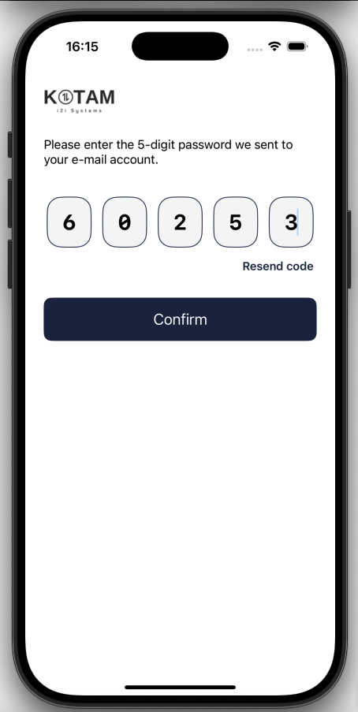
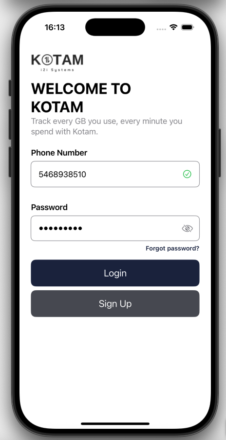
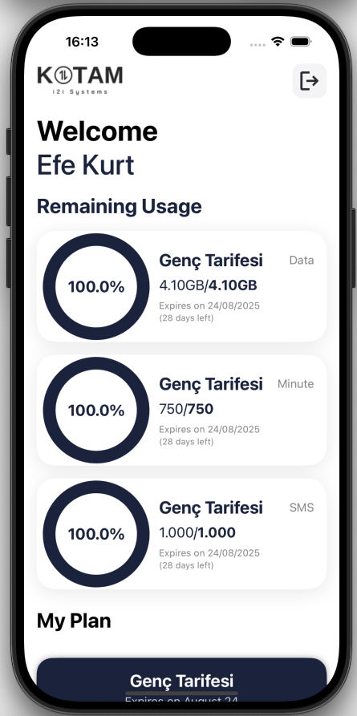

# Kotam iOS Uygulaması

## Proje Hakkında

Kotam iOS uygulaması, kullanıcıların kendi tarifelerini, kalan kullanım haklarını ve hesap işlemlerini kolayca yönetebileceği modern bir mobil uygulamadır. SwiftUI ile geliştirilmiş olup, kullanıcı dostu ve sade bir arayüz sunar. Uygulama, güvenli giriş, kayıt, şifre sıfırlama, doğrulama ve kalan kullanım takibi gibi birçok özelliği kapsamaktadır.

---

## Temel Özellikler

### Kullanıcı Girişi ve Kayıt
- Telefon numarası ve şifre ile giriş.
- Kayıt ekranında isim, soyisim, T.C. kimlik, e-posta, telefon ve güçlü şifre gereksinimleri.
- Şifre gereksinimleri: En az 8 karakter, büyük harf, rakam ve sembol zorunluluğu.
- Kayıt sonrası tarife seçimi ve otomatik paket atama.

### Şifre Sıfırlama ve Doğrulama
- E-posta ve T.C. kimlik ile şifre sıfırlama talebi.
- E-posta ile gönderilen 5 haneli kodun girilmesi ve doğrulanması.
- Yeni şifre belirleme ekranı.

### Kalan Kullanım ve Paket Takibi
- Kullanıcıya özel karşılama ve kalan kullanım ekranı.
- Data, dakika ve SMS haklarının anlık ve grafiksel takibi.
- Paket bitiş tarihi ve kalan gün bilgisi.
- Aktif plan detayları ve özet kartı.

### Modern ve Kullanıcı Dostu Arayüz
- Tüm ekranlarda sade, anlaşılır ve profesyonel tasarım.
- Hatalı girişlerde üstte animasyonlu uyarı sistemi.
- Tüm formlarda anlık doğrulama ve görsel geri bildirim.

---

## Ekran Görüntüleri

### Kod Doğrulama Ekranı

### Giriş Ekranı

### Kalan Kullanım Ekranı

